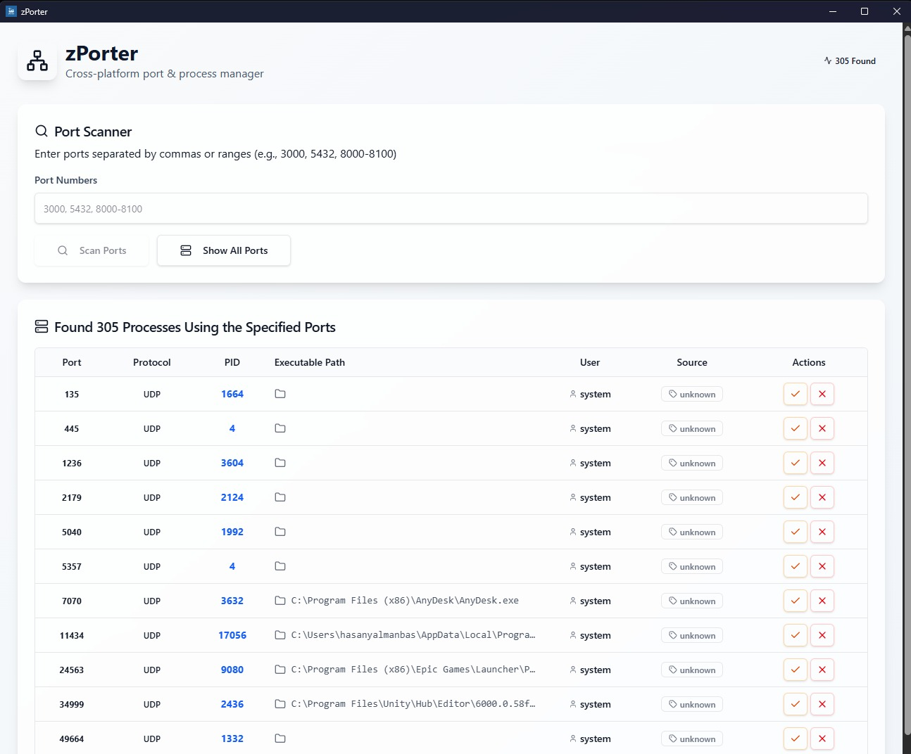

# zPorter

[](https://opensource.org/licenses/MIT)
[](https://tauri.app/)
[](https://reactjs.org/)
[]()

A fast, safe, GUI-first utility to identify which process holds a specific port and free that port by terminating the owning process (gracefully, then forcefully if needed). Supports multiple ports, batch actions, and minimal friction across macOS, Windows, and Linux.

## ✨ Features

- 🔍 **Port Scanning**: Search for processes using specific ports
- 💀 **Process Termination**: Graceful or force kill processes
- 🔄 **Batch Operations**: Terminate multiple processes at once
- 🎯 **Source Detection**: Identify Docker containers, systemd services, launchd services, and brew services
- 🛡️ **Safety First**: Confirmation dialogs and permission handling
- 🌍 **Cross-Platform**: Works on macOS, Windows, and Linux
- 🎨 **Modern UI**: Clean, responsive interface built with shadcn/ui + Tailwind CSS

## 📸 Screenshots




## 🚀 Installation

### macOS

Download the latest `.dmg` file from [Releases](https://github.com/hasanyalmanbas/zporter/releases) and drag to Applications.

### Windows

Download the `.exe` or `.msi` installer from [Releases](https://github.com/hasanyalmanbas/zporter/releases).

### Linux

Download the `.AppImage` from [Releases](https://github.com/hasanyalmanbas/zporter/releases) and make it executable:

```bash
chmod +x zporter.AppImage
./zporter.AppImage
```

## 🛠️ Development

### Prerequisites

- [Node.js](https://nodejs.org/) (v18 or later)
- [Rust](https://rustup.rs/) (latest stable)
- [Tauri CLI](https://tauri.app/v1/guides/getting-started/prerequisites)

### Setup

1. Clone the repository:
```bash
git clone https://github.com/hasanyalmanbas/zporter.git
cd zporter
```

2. Install dependencies:
```bash
npm install
```

3. Run in development mode:
```bash
npm run tauri:dev
```

### Building

```bash
# Development build
npm run tauri:dev

# Production build
npm run tauri:build
```

## 📖 Usage

1. **Search Ports**: Enter port numbers (comma-separated) in the search box
2. **View Results**: See all processes using the specified ports
3. **Terminate Processes**:
   - Click the orange button for graceful termination
   - Click the red button for force termination
4. **Filter Options**: Toggle "Only listening" to show only listening sockets

### Command Line Usage

The application provides a GUI interface. For CLI alternatives, consider using:
- `lsof -i :PORT`
- `netstat -tulpn | grep :PORT`
- `ss -tulpn | grep :PORT`

## 🔧 Architecture

- **Frontend**: React + TypeScript + Mantine UI
- **Backend**: Rust + Tauri + sysinfo
- **Packaging**: Tauri bundler for cross-platform distribution

### Key Components

- **Port Scanner**: Uses system tools (`lsof`, `netstat`) to find port usage
- **Process Manager**: Leverages `sysinfo` crate for process information and termination
- **Source Detector**: Heuristics-based detection of service sources
- **UI Framework**: shadcn/ui components with Tailwind CSS styling

## 🤝 Contributing

We welcome contributions! Please see our [Contributing Guide](CONTRIBUTING.md) for details.

### Development Workflow

1. Fork the repository
2. Create a feature branch: `git checkout -b feature/your-feature`
3. Make your changes and test thoroughly
4. Submit a pull request

## 📋 Requirements

### Functional Requirements
- ✅ Accept single or multiple ports as input
- ✅ Display processes currently listening on ports
- ✅ Provide per-row termination actions
- ✅ Support batch termination
- ✅ Handle permission errors gracefully
- ✅ Detect and label common service sources

### Non-Functional Requirements
- ✅ Cross-platform compatibility
- ✅ Fast UI updates (<200ms)
- ✅ Small installer size (<50MB)
- ✅ Robust error handling

## 🐛 Troubleshooting

### Common Issues

**Port not found**: Make sure the port is actually in use. Check with `lsof -i :PORT`

**Permission denied**: Some processes require administrator privileges. The app will prompt for elevation.

**Process won't terminate**: Try force termination, or the process may be protected by the system.

### System Requirements

- **macOS**: 12.0+
- **Windows**: 10/11
- **Linux**: glibc-based distributions

## 📄 License

This project is licensed under the MIT License - see the [LICENSE](LICENSE) file for details.

## 🙏 Acknowledgments

- [Tauri](https://tauri.app/) for the amazing desktop app framework
- [shadcn/ui](https://ui.shadcn.com/) for the beautiful UI components
- [Tailwind CSS](https://tailwindcss.com/) for styling
- [sysinfo](https://crates.io/crates/sysinfo) for system information
- [Lucide Icons](https://lucide.dev/) for the icon set

## 📞 Support

- 📧 Email: hasanyalmanbas@gmail.com
- 🐛 Issues: [GitHub Issues](https://github.com/hasanyalmanbas/zporter/issues)
- 💬 Discussions: [GitHub Discussions](https://github.com/hasanyalmanbas/zporter/discussions)

---

Made with ❤️ using Tauri and React
